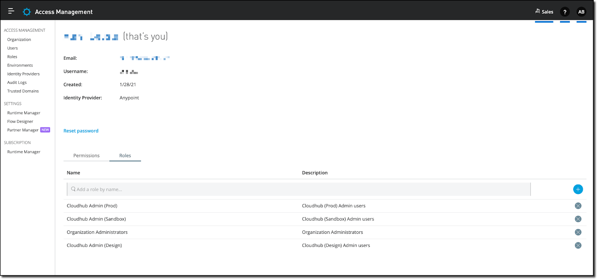

# Add Flex Gateway to Kubernetes

## Overview

This Codelab provides supporting documentation for installing Anypoint Flex
Gateway as an ingress controller on a generic Kubernetes cluster (i.e., not
cloud-platform specific).

## Prerequisites

- A running Kubernetes cluster
- `kubectl` configured

```bash
kubectl get nodes
```

## Register Flex Gateway

When adding Flex Gateway to Kubernetes, register it through Anypoint Runtime
Manager. The organization id and registration token are prepopulated for the
selected business group and environment.



Register the gateway with Anypoint Platform:

```bash
flexctl registration create \
  --client-id="$CLIENT_ID" \
  --client-secret="$CLIENT_SECRET" \
  --output-directory=./registration
```

## Verify the deployment

```bash
kubectl get pods -n gateway
```

Congratulations — Flex Gateway is running as your ingress controller.
